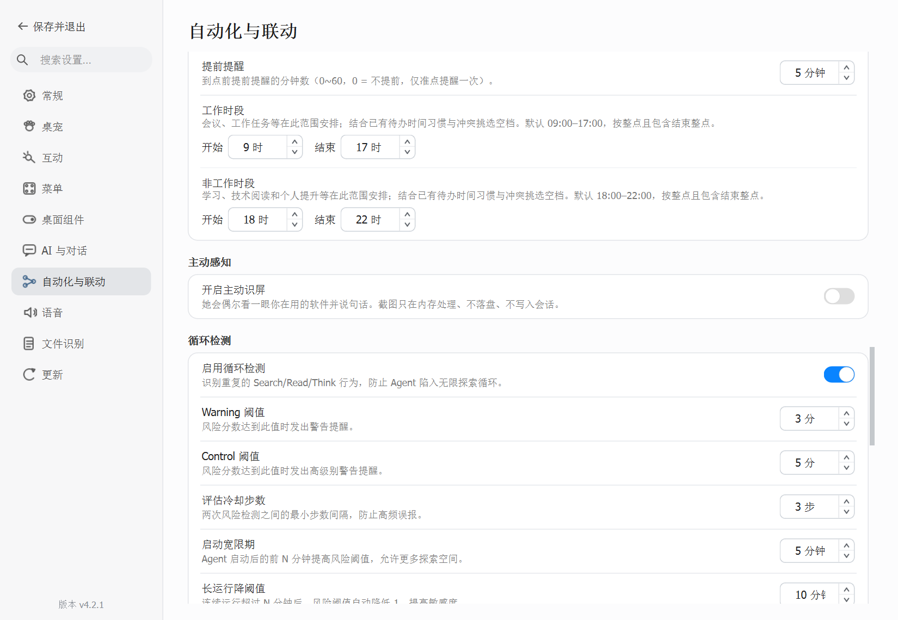
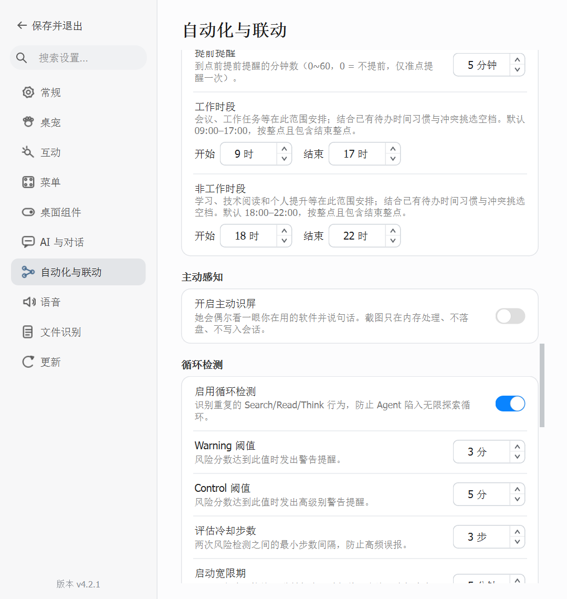
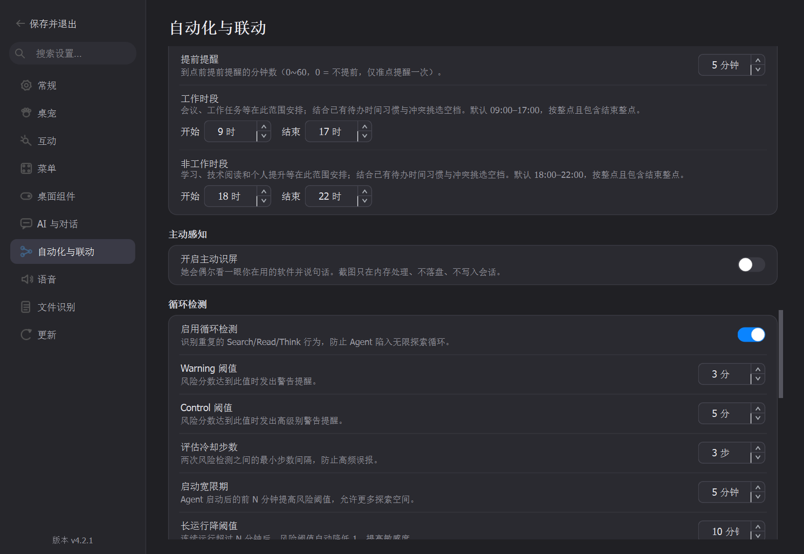

# 待办自动排期：工作/非工作时段与时间习惯

> **基线**：`bd87d3a9453858c97e92d376e90b010f4355d75c`（PR #193 分支头）
>
> **分支**：`codex/todo-habit-schedule`　**日期**：`2026-09-28`
>
> **范围**：10 个文件（实现 4、配置快照 1、文档 2、截图 3）
> **关联**：[PR #193](https://github.com/MerZlin/dsh-pet-indesktop/pull/193)；设置变更契约见 [`SETTINGS-CHANGE-GATES.md`](SETTINGS-CHANGE-GATES.md)，交付报告格式见 [`PR-REPORT-TEMPLATE.md`](PR-REPORT-TEMPLATE.md)。

## 一、核心特性

文本生成 Agent 会逐项分析事项时段：会议、工作事项、赶进度和完成任务归入工作时段；学习技术、技术阅读、个人提升和明确的休息安排归入非工作时段；语义不明时才允许两个时段。用户明确写出的钟点始终优先。

设置页分别提供工作时段（默认 09:00–17:00）与非工作时段（默认 18:00–22:00），起止精确到整点且包含结束整点。排期器只在分类对应的时段内查空档，先避开现有待办前后 60 分钟内的时间，再参考已有待办的时段分布；每天重复待办权重为 2，未来 7 天内的一次性待办权重为 1。

**红线 / 不变量**：明确时间不被自动改写；分类为 work/rest 的事项不会被挪到另一个时段；已有全局提醒提前量保持不变；不读取外部日历，不新增完成历史或标题数据采集。

## 二、修改文件说明

以下增删来自 `git diff --numstat`；新文件截图为二进制文件，Git 不报告行数。

| 文件 | 增删 | 改动意图 |
|---|---:|---|
| `pet/todo_agent.py` | +95 / −11 | 要求 LLM 输出逐事项 `schedule_period`，并按工作/非工作时段、冲突和已有待办习惯挑选整点。 |
| `pet/config.py` | +40 / −0 | 保存四个起止时段键，并以一次批量设置方法原子更新两个时间范围；无效或相等区间回退到 09–17 / 18–22 默认值。 |
| `pet/settings_pet_controls.py` | +46 / −0 | 复用设置页数字微调控件提供两组可访问的整点区间。 |
| `pet/modern_settings_dialog.py` | +20 / −1 | 将两组时段放入「自动化与联动 → 待办提醒」，并在保存时批量写入配置。 |
| `tests/test_config_schema.py` | +6 / −2 | 更新配置默认值/重载白名单快照，登记四个新增键。未新增行为测试。 |
| `docs/INDEX.md` | +3 / −2 | 登记本报告，并在设置门禁和报告模板条目中互链本次设置契约实例。 |
| `docs/PR-REPORT-TODO-SCHEDULE-HABITS-2026-09-28.md` | +102 / −0 | 记录设计、文件影响、实测性能、Windows 设置页运行证据与限制。 |
| `docs/screenshots/todo-schedule-2026-09-28/automation-1100-light.png` | 二进制 | 1100×760 Windows 设置页截图。 |
| `docs/screenshots/todo-schedule-2026-09-28/automation-720-light.png` | 二进制 | 720×760 窄窗口布局截图。 |
| `docs/screenshots/todo-schedule-2026-09-28/automation-1100-dark.png` | 二进制 | 1100×760 深色设置页截图。 |

## 三、实现要点

- Agent 系统提示要求对一条消息中的每个事项分别判定 `work`、`rest` 或 `any`。技术学习即使与工作相关也归 rest；会议、工作事项、赶进度和完成任务归 work。
- `parse_todo_response` 只在事项没有明确时间时使用分类。work/rest 只搜索对应窗口；any 搜索两个窗口的并集。某个分类的窗口里没有可用空档时，该事项不会被移到另一时段。
- 空闲排序优先减少 60 分钟缓冲内的冲突，然后比较当天已有待办数量，再按该时段内已有时间分布的相似度排序，最后取较早的日期/整点。重复待办比近期一次性待办的习惯权重高一倍。
- 工作与非工作区间均为同一天的整点范围，允许用户自行重叠；配置脏值或起点不早于终点时各自恢复默认值。设置保存沿用现有设置对话框提交时机。
- 设置对话框通过 `Config.set_todo_schedule_windows` 一次提交两组范围，避免逐键归一化时暂时看到起止不匹配。
- LLM 仍使用当前配置的 Chat Completions provider 和同一份聊天额度；每条输入仍是原有的一次请求。LLM 会看到用户消息和原有的待办日期/时间快照（不含标题）；本改动没有增加第二次请求或上传新字段。

## 四、性能分析

**方法（可复现）**：Python `timeit.repeat`，30 个启用待办（6 个 daily、24 个一次性），固定本地时间 `2026-09-28 08:00`，搜索今天至未来 7 天；每轮 1,000 次、重复 7 轮，报告最佳一轮。环境：Windows 10、Python 3.10.15、PySide6 6.8.0.2、Intel Core i7-14700HX。

```powershell
python -c 'from datetime import datetime, timedelta; from timeit import repeat; from pet.todo_agent import find_available_todo_slot; now=datetime(2026,9,28,8,0); todos=[{"kind":"daily","date":"","time":f"{hour:02d}:00","enabled":True} for hour in (8,12,14,16,18,20)]; todos += [{"kind":"once","date":(now.date()+timedelta(days=index%7)).isoformat(),"time":f"{9+index%13:02d}:15","enabled":True} for index in range(24)]; samples=repeat(lambda: find_available_todo_slot(todos, now, schedule_period="any"), number=1000, repeat=7); print("todos=%d loops=1000 best_us_per_call=%.1f" % (len(todos), min(samples)*1000))'
```

实测输出：`todos=30 loops=1000 best_us_per_call=490.6`。

| 指标 | 实测/上限 | 归属 |
|---|---:|---|
| 单次本地排期搜索 | 490.6 µs / 次（30 条待办，7×1,000 次的最佳轮） | 新增评分路径 |
| 单次输入最多排期调用 | 5 次（`_MAX_RESULTS` 上限；只对没有明确时间的事项调用） | 新增路径，按用户输入触发 |
| 搜索候选格上限 | 192 个（8 天 × 最多 24 个不重复整点） | 临时计算 |
| 已启用待办快照上限 | 105 条（`TODO_ITEMS_LIMIT=100` + 最多 5 条新结果） | 既有边界 |
| 系统提示增长 | +202 个 Unicode 字符；模型 tokenizer token 数未测 | 每次既有 LLM 请求 |

稳态空闲路径没有新增定时器或后台任务；本地评分只在已有 Agent 完成模型响应后、且事项缺少钟点时执行。没有新增网络请求、线程或排期时的磁盘访问；四个设置标量只在用户保存设置时通过原配置路径持久化。排期临时列表最多 105 条快照和 192 个候选项，函数返回后释放；没有长期缓存或历史记录增长。

## 五、实机运行记录

**环境**：Windows 10；Qt 平台插件输出 `windows`；Python 3.10.15；PySide6 6.8.0.2。

| 操作 | 命令/输出 | 可见结果 |
|---|---|---|
| 打开真实设置窗口并定位工作时段行，1100×760 | `python .scratch/todo-habit-schedule/capture_hours_setting.py 1100 760 light ...`；输出 `qt_platform=windows`，退出码 0 | 显示工作时段 09–17 与非工作时段 18–22。 |
| 窄窗口与深色布局 | 同一窗口采集脚本分别使用 720×760 浅色、1100×760 深色；两次退出码均为 0 | 文案按字体宽度换行，起止控件仍可见；截图已纳入本 PR。 |
| LLM 分类接口 | 本轮没有向当前配置 provider 发送探测请求 | 实际调用会计入用户正在使用的聊天模型额度；本次只验证了本地界面，不声称在线模型分类已实测。 |

截图：







## 六、测试与验证

| 门 | 命令 | 结果 |
|---|---|---|
| 静态检查 | `python -m ruff check pet/config.py pet/settings_pet_controls.py pet/modern_settings_dialog.py pet/todo_agent.py tests/test_config_schema.py` | 通过。 |
| 差异空白检查 | `git diff --check` | 通过。 |
| pytest | 未运行 | 本次没有运行测试套件；不报告行为测试或全量通过。 |
| 设置页视觉采集 | `python .scratch/todo-habit-schedule/capture_hours_setting.py`（Windows Qt） | 1100/720 浅色与 1100 深色截图均成功；未使用 offscreen 平台。 |

## 七、已知限制与后续

- “习惯”从当前启用的 daily 待办和未来 7 天一次性待办时刻推导，不读取完成记录、不学习历史，也不接入系统日历。
- LLM 负责语义分类，错误分类会把事项限制在错误时段；歧义类别 any 会同时搜索两个时段。工作/非工作窗口没有按星期分别设置，也只支持整点。
- 若某事项所属窗口在指定日期或搜索范围内没有空档，该事项不跨到另一个时段；生成结果可能因此少于识别事项数。
- 没有调用真实 LLM 验证分类输出，避免为验收额外消耗用户当前聊天额度。实际模型遵循度仍需用户在已有设置下运行后确认。

## 八、风险与回滚

- 配置新增 `todo_schedule_work_start_hour`、`todo_schedule_work_end_hour`、`todo_schedule_rest_start_hour`、`todo_schedule_rest_end_hour` 四个标量，旧配置通过默认值兼容；范围错误回退到 09–17 / 18–22。
- 回滚代码后旧版会忽略这四个新键，不影响待办文件；若要移除设置值，可手动删掉对应配置键。没有新增缓存、数据库或网络写入。
- LLM 解析结果增加可选的 `schedule_period` 字段；旧响应没有该字段时按 `any` 处理。
